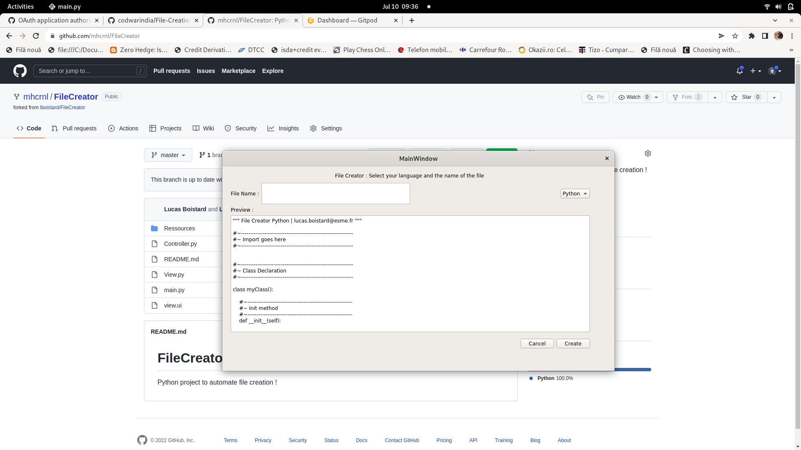

# PyQt5 GUI application FileCreator
Python project to automate file creation !


## Installation
```
https://github.com/mhcrnl/FileCreator.git
```

## Usage
```python
$ python main.py
```

## Contributing
Pull requests are welcome. For major changes, please open an issue first to discuss what you would like to change.

Please make sure to update tests as appropriate.

## License
[MIT](https://choosealicense.com/licenses/mit/)


# Folder-Creation with python
